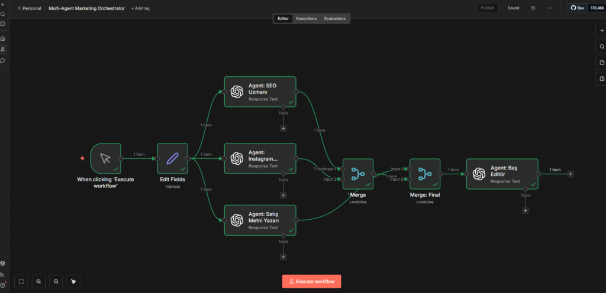

# 🐙 Multi-Agent Marketing Orchestrator

> **"One-Man Agency": An autonomous system where specialized AI Agents (SEO, Social, Copywriter) work in parallel to build a full launch strategy.**

## 🚨 The Problem
Launching a product requires a team of experts: an SEO specialist, a Social Media manager, and a Copywriter.
* **Costly:** Hiring freelancers for each role is expensive for solopreneurs.
* **Fragmented:** Managing separate experts takes time.
* **Low Quality:** Asking a single generic AI (like ChatGPT) to "do everything" results in loss of focus and generic outputs.

## ✅ The Solution
This automation simulates a **Marketing Agency** within n8n using a **Parallel Execution Architecture**.
Instead of one linear process, the system splits the task into 3 specialized branches. Different AI Agents, equipped with **Role-Based Prompts**, work simultaneously on the same product data. Finally, a "Head Editor" agent merges their outputs into a cohesive strategy report.

## 🤖 The Agent Squad

| Agent Role | Responsibility |
|------------|----------------|
| **🔍 SEO Specialist** | Researches high-volume keywords, creates meta titles/descriptions, and analyzes search intent. |
| **📱 Social Media Manager** | Drafts engaging scripts for Instagram Reels/Stories and plans a content calendar. |
| **✍️ Copywriter** | Writes persuasive landing page copy using sales psychology frameworks (AIDA/PAS). |
| **👔 Head Editor** | Collects all data, reviews consistency, and compiles the **Final Launch Report**. |

## 🛠 Tech Stack & Key Concepts

* **n8n Workflow:** Orchestration of multiple AI agents.
* **Parallel Branching:** Executing multiple complex tasks simultaneously (Async processing).
* **Data Merging:** Consolidating JSON outputs from different branches into a single dataset.
* **Role-Based Prompting (GPT-4o):** Assigning specific personas to AI models for expert-level output.
* **JSON to Document:** Converting structured data into a readable report format.

## ⚙️ How It Works

1.  **Input:** The user enters the "Product Name" and "Target Audience".
2.  **Orchestration (Split):** The workflow splits into 3 parallel paths.
3.  **Execution:**
    * *Branch A:* AI analyzes SEO trends.
    * *Branch B:* AI writes social media scripts.
    * *Branch C:* AI drafts sales copy.
4.  **Convergence (Merge):** The system waits for all agents to finish.
5.  **Final Polish:** The "Manager Agent" compiles the results into a unified strategy document.

## 🚀 How to Use

1.  Import the `workflow.json` file into n8n.
2.  Add your **OpenAI API Key** credential.
3.  Run the workflow and enter a product idea (e.g., "Ergonomic Office Chair").
4.  View the JSON output or the generated report to see the full strategy.

---

### 👤 Author
**Emrah Digital** - *Automation & AI Solutions*
[Visit my Website](https://emrahdemirkoc.com)
